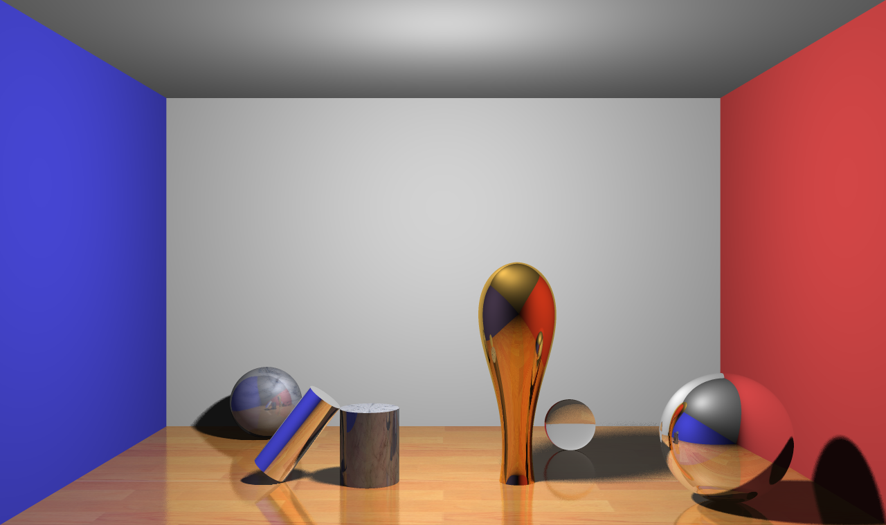
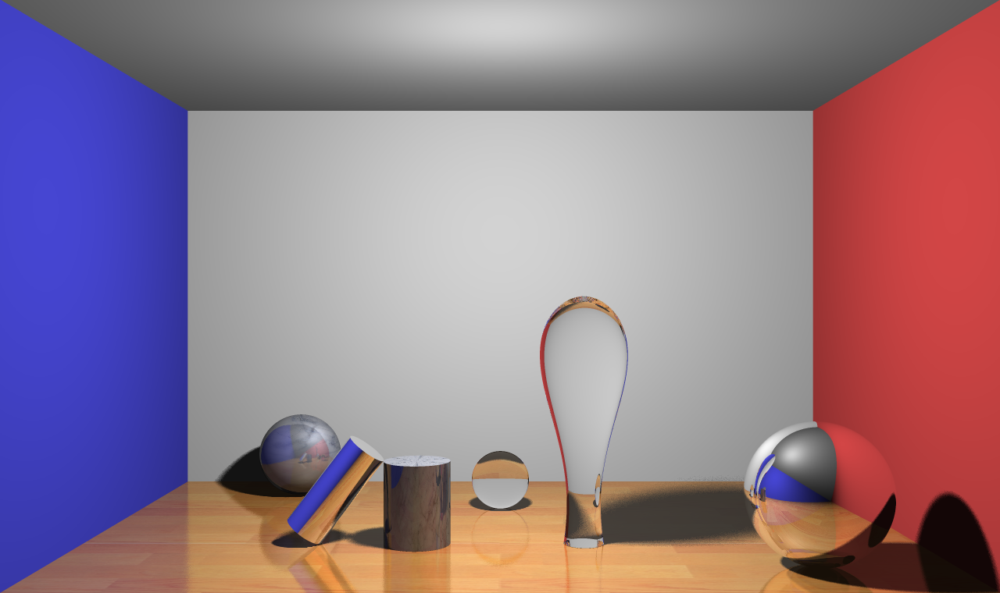
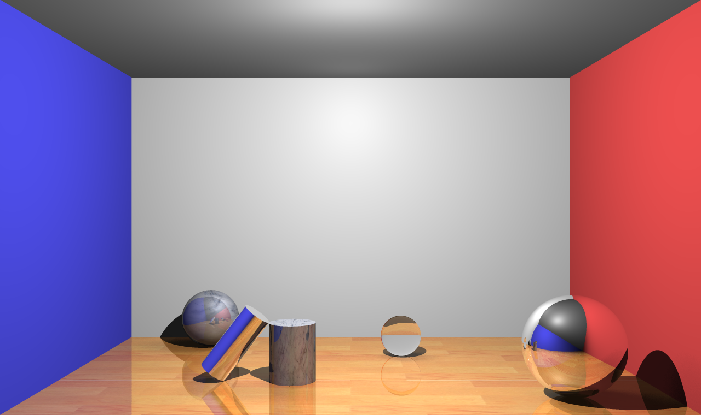
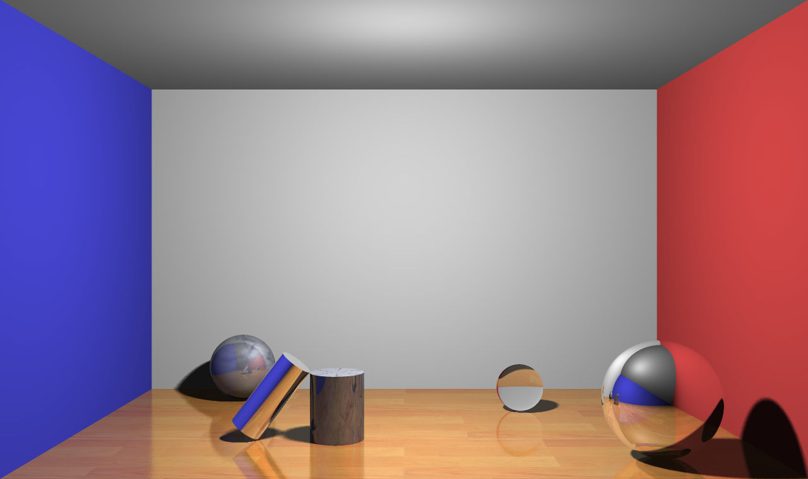
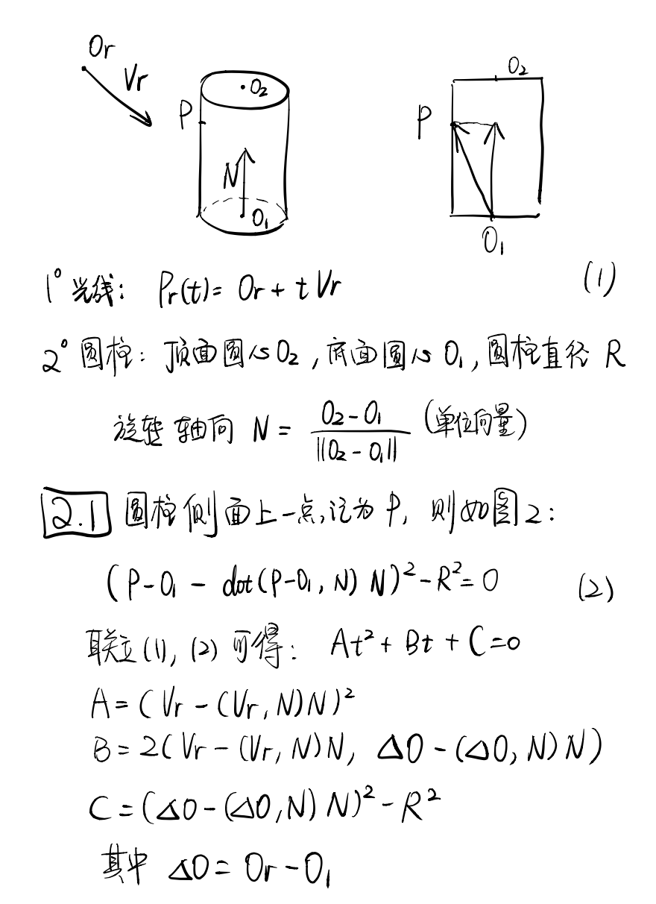
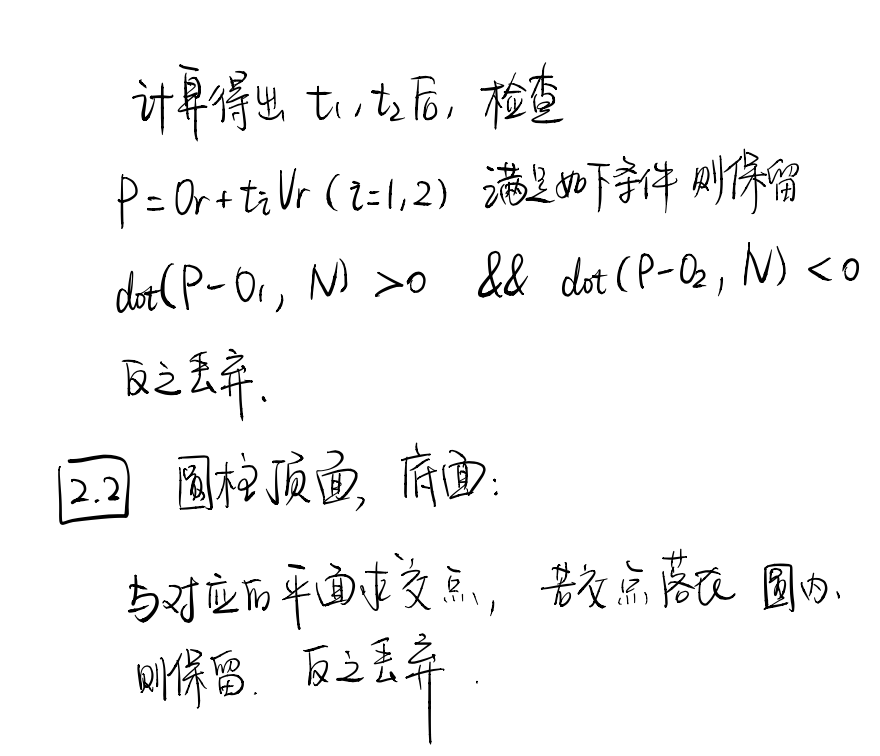
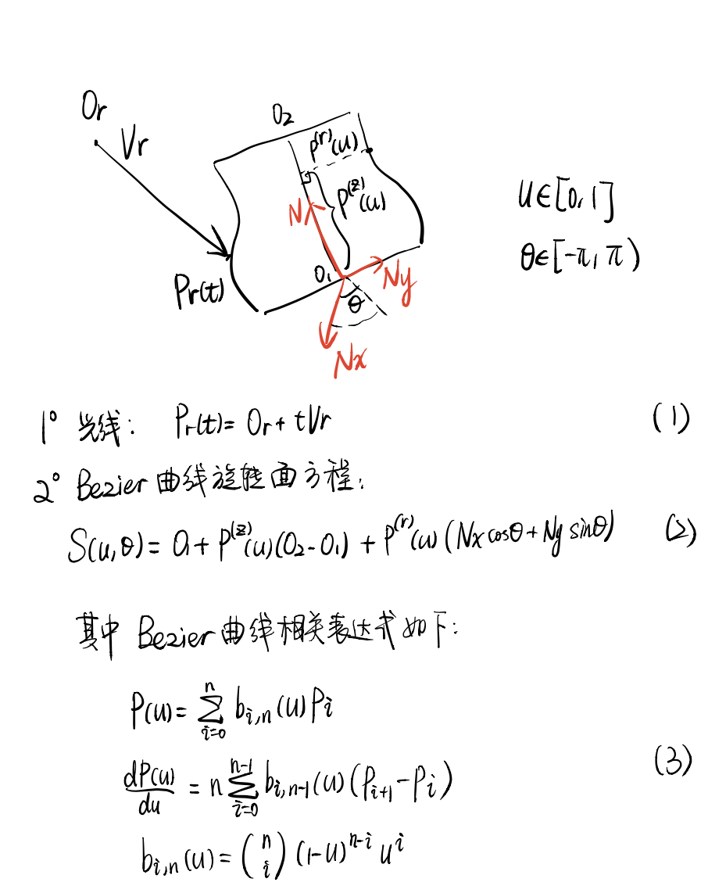
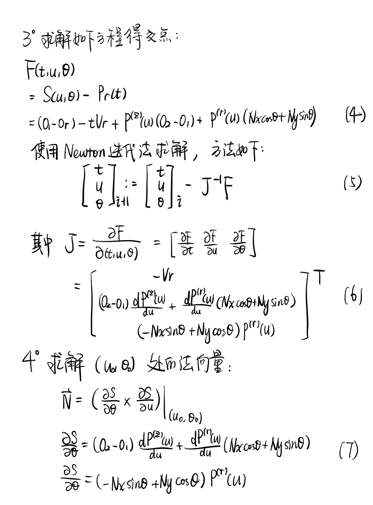

# A5-RayTracing

许书畅 2018213822 xsc14thu@foxmail.com

### 一、效果概览

1. `矩形区域光源` + `地板expBlur反射` + `反射材质Bezier旋转体`



2. `矩形区域光源` + `地板expBlur反射` + `折射材质Bezier旋转体`



3.  `地板expBlur反射` VS `地板理想镜面反射`

|                     `地板理想镜面反射`                     |                    `地板expBlur反射`                     |
| :--------------------------------------------------------: | :------------------------------------------------------: |
|  |  |


### 二、实验环境

macOS15.1

使用Eigen库进行矩阵运算。


### 三、实验原理

#### 3.1 光线与圆柱体求交





#### 3.2 光线与Bezier曲线旋转体求交






##### 2. 曲面参数化与公式推导

注意：

1. 使用牛顿迭代法时，初值的设置对于找到合适交点非常重要。为此，本项目使用光线与外圆柱体包围盒的交点作为迭代初值。对于$u$和$\theta$的预估如下：

   ```c++
   			Vector3 delta0 = boundCollisions[i].C - O1;
   			double u0 = (delta0.Dot(N)) / (O2 - O1).Module();
   			double theta0 = atan2(delta0.Dot(Ny), delta0.Dot(Nx));
   ```

   

2. 由于牛顿迭代法求出的交点存在微小误差。这会导致求交后，再次发出的反射光线/折射光线/阴影测试线的起点被困在模型内部，从而无法正确求交。为此，可以将交点$C$沿法向$N$进行微小偏移。具体更新规则如下：

   - 如反射/阴影测试：$C:=C+alpha * N$
   - 如折射：$C:=C-alpha * N$
   - 本项目中，$alpha = 0.01$

   

#### 3.3 面光源与球状光源

对于面光源与球状光源，每次发射阴影测试线时，在面区域内/球面上随机选取16个点，测试连线上是否有物体遮挡。这样的方式最终可以实现软阴影，但阴影的质量受采样点数目影响较大。

对于球状光源，代码摘录如下：

```C++
double SphereLight::CalnShade( Vector3 C , Primitive* primitive_head , int shade_quality ) {
	int shade = 0;
	for (int i = 0; i < 16; i++) 
		for (int k = 0; k < shade_quality; k++) {
			double theta = (2 * ran() - 1) * PI;
			double psi = (2 * ran() - 1) * PI / 2;
			Vector3 V = O - C + Vector3(R*cos(psi)*cos(theta), R*cos(psi)*sin(theta), R*sin(psi));
			double dist = V.Module();

			for (Primitive* now = primitive_head; now != NULL; now = now->GetNext()) {
				CollidePrimitive tmp = now->Collide(C, V);
				if (tmp.isCollide) {
					if (tmp.dist - dist < -EPS) {
						shade++;
						break;
					}
				}
			}
		}
	return 1 - (double)shade / (16.0 * shade_quality);
}
```


#### 3.4 非理想镜面反射

对于非理想镜面反射，通过对光线加入一定随机偏移，来模拟有一定漫反射的情况。

具体方法是，如果材质中dreflect参数不为0，对反射光线的方向进行随机偏移。本项目中采样16次。

```c++
Color Raytracer::CalnReflection(CollidePrimitive collide_primitive , Vector3 ray_V , int dep , int* hash ) {
	
	if (!collide_primitive.isAccurate) collide_primitive.C += collide_primitive.N * 0.01;
	Primitive* primitive = collide_primitive.collide_primitive;
	ray_V = ray_V.Reflect( collide_primitive.N );

	if ( primitive->GetMaterial()->drefl < EPS || dep > MAX_DREFL_DEP )
		return RayTracing(collide_primitive.C, ray_V, dep + 1, hash) * primitive->GetMaterial()->color * primitive->GetMaterial()->refl;
	else
	{
		//ADD BLUR
		Vector3 Dx = ray_V * Vector3(1, 0, 0);
		if (Dx.IsZeroVector()) Dx = Vector3(1, 0, 0);
		Vector3 Dy = ray_V * Dx;
		Dx = Dx.GetUnitVector() * primitive->GetMaterial()->drefl;
		Dy = Dy.GetUnitVector() * primitive->GetMaterial()->drefl;

		Color ret;
		for (int k = 0; k < 16 * camera->GetDreflQuality(); k++) {
			double x, y;
			x = primitive->GetMaterial()->blur->GetXY().first;
			y = primitive->GetMaterial()->blur->GetXY().second;
			x *= primitive->GetMaterial()->drefl;
			y *= primitive->GetMaterial()->drefl;

			ret += RayTracing(collide_primitive.C, ray_V + Dx * x + Dy * y, dep + MAX_DREFL_DEP, NULL);
		}

		ret = ret * primitive->GetMaterial()->color * primitive->GetMaterial()->refl / (16 * camera->GetDreflQuality());
		return ret;
	}
}
```