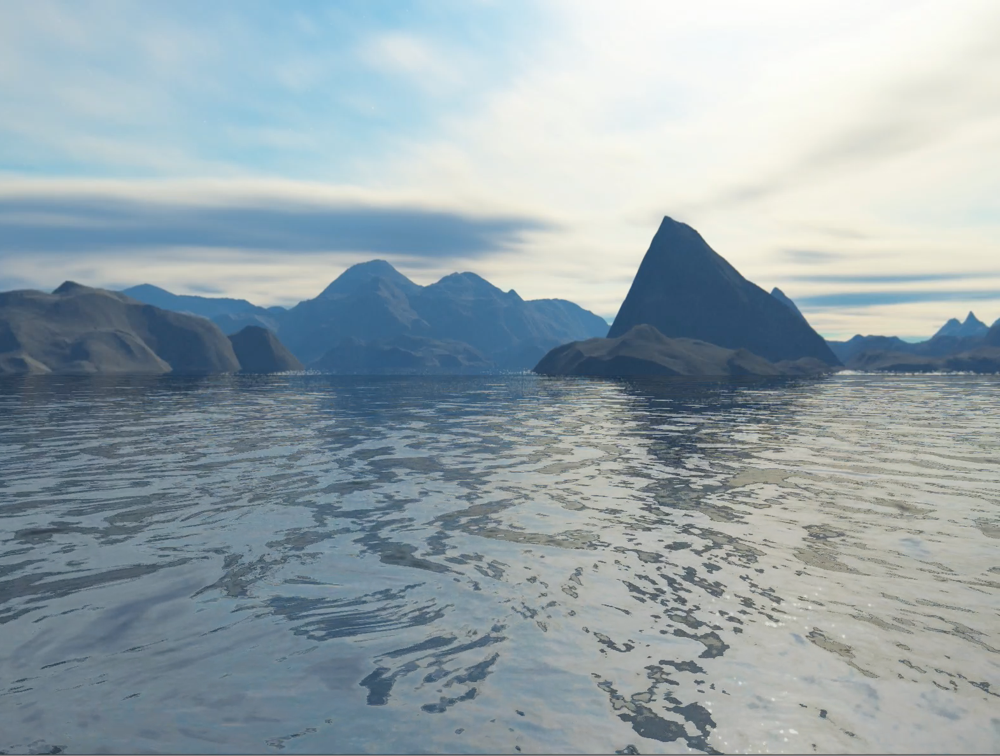
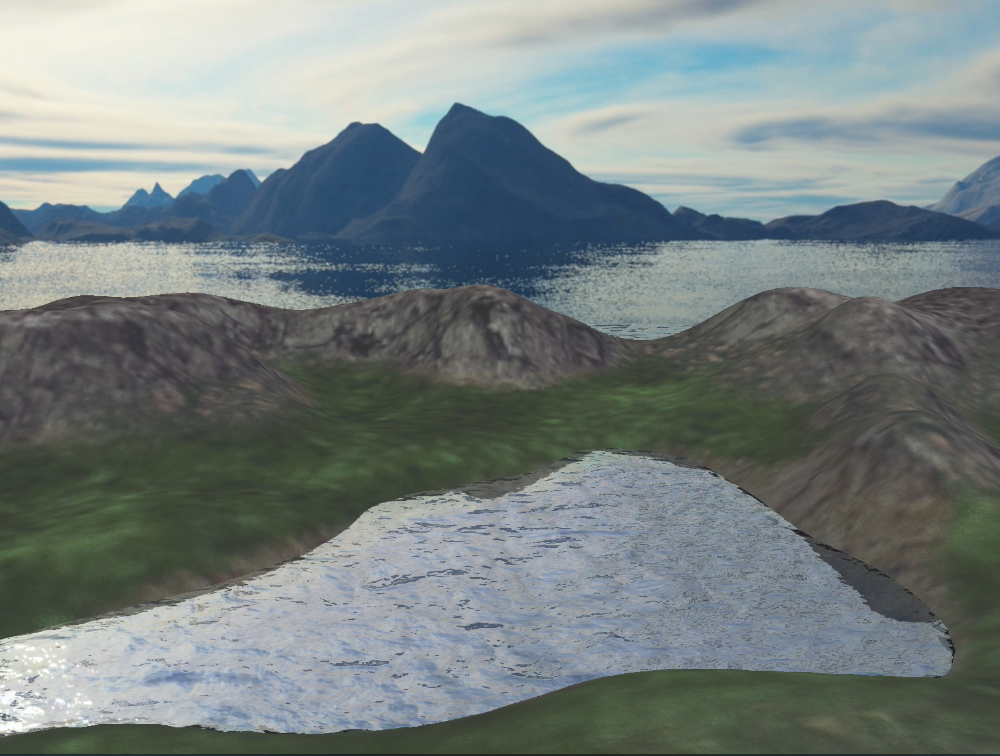
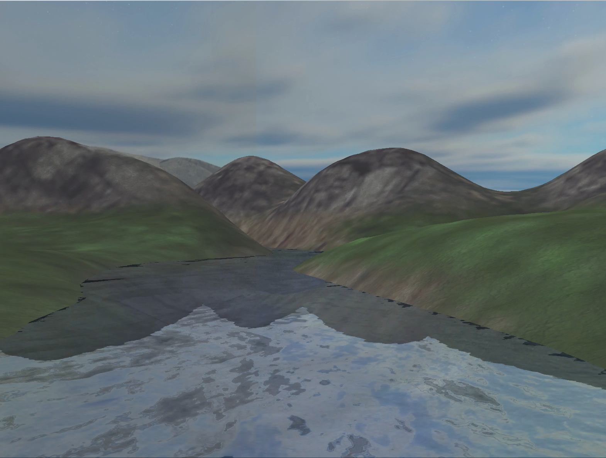

# A6-Terrain Engine

### 一、效果概览

流动的水面：



地形：



倒影：




### 二、实验环境

macOS15.1, OpenGL4

依赖库：GLFW3(窗口管理), GLAD(指针管理), GLM(矩阵运算), SOIL(图像读取)


### 三、实验原理

#### 3.1 天空盒

使用`CUBEMAP`制作天空盒。原理参考：[立方体贴图 - LearnOpenGL CN](https://learnopengl-cn.github.io/04%20Advanced%20OpenGL/06%20Cubemaps/)

#### 3.2 水面流动效果

`法线贴图`和`贴图坐标平移`是实现水面流动和波动效果的基础。

为了制造逼真的水面流动效果，本项目使用了`FlowMap技术`（SIGGRAPH 2010）。该技术的核心在于，使用一张FlowMap贴图作为水流方向的指导，从而使得水面各点的流动方向各有不同，避免明显的重复。

FlowMap技术的另一个核心点在于，使用两张法向贴图，通过加权平均，实现平滑效果，避免周期性变化时的不连续现象。


相关部分代码摘录如下：

```
    float flowSpeed = 0.1f;
    vec2 flowTil = vec2(tiling/1.3f, tiling/1.3f);
    vec2 texTil = vec2(tiling, tiling);
    vec2 flowVec = (texture(texture_flowmap, TexCoords * flowTil).rg * 2.0f - 1.0f);
    float cycleOffset = texture(texture_noise, TexCoords* flowTil).r;
    
    float prePhase = cycleOffset + time;
    float phase0 = prePhase - floor(prePhase);
    float phase1 = prePhase + 0.5f - floor(prePhase + 0.5f);
    float lerpfactor = (abs(.5f - phase0) / .5f);
    
    vec4 normalT0 = texture(texture_normal0, TexCoords* texTil + flowVec * flowSpeed * phase0);
    vec4 normalT1 = texture(texture_normal1, TexCoords* texTil + flowVec * flowSpeed * phase1);
    vec3 normalMix = vec3(mix(normalT0, normalT1, lerpfactor));
    vec3 normalT;
    normalT.xz = normalMix.xy * 2.0f - 1.0f;
    normalT.y = sqrt(1 - normalT.x * normalT.x - normalT.z * normalT.z);
```

[参考资料]

[Animating Water Using Flow Maps](http://graphicsrunner.blogspot.com/2010/08/water-using-flow-maps.html)

http://advances.realtimerendering.com/s2010/index.html

#### 3.3 地形构造与贴图

为了便于在项目中加入光照效果，需要计算并高效获取每一顶点处的法向。

为此，我将heightMap读入后，存储在了顶点数组中，同时通过EBO来索引连接关系。最终通过对相邻面的法向按面积进行加权，计算了每个地形点的法向，传递给着色器。

[参考资料]

https://blogs.igalia.com/itoral/2016/10/13/opengl-terrain-renderer-rendering-the-terrain-mesh/

#### 3.4 倒影渲染

使用帧缓冲技术（[帧缓冲 - LearnOpenGL CN](https://learnopengl-cn.github.io/04%20Advanced%20OpenGL/05%20Framebuffers/)），制作反射与折射效果。

1. **反射效果：**首先以水平面为对称面，将地形进行翻转。随后利用帧缓冲技术，将地形翻转后水面以下的部分渲染到贴图中。该贴图传递给水面渲染着色器后，Fragment Shader沿法向对贴图采样坐标进行一定偏移，从而制作出有偏移的反射效果。
2. **折射效果**：将水面以下的原地形渲染到折射贴图中，Fragment Shader沿法向对贴图采样坐标进行一定偏移，和直接采样结果进行混合，从而制作出有偏移的反射效果。

相关部分代码摘录如下：

```GLSL
		vec3 vRefrBump = normalT.xyz * vec3(0.075, 1.0, 0.075);
    vec3 vReflBump = normalT.xyz * vec3(0.02, 1.0, 0.02);

    vec2 texelSize = 1.0 / vec2(textureSize(texture_reflect, 0));
    vec4 refrColor = texture(texture_refract, gl_FragCoord.xy * texelSize + vRefrBump.xz);
    vec4 reflColor = texture(texture_reflect, gl_FragCoord.xy * texelSize + vReflBump.xz);
    vec4 refrB = texture(texture_refract, gl_FragCoord.xy * texelSize);

    vec4 refraction = refrB * refrColor.w + refrColor * (1 - refrColor.w);
```

