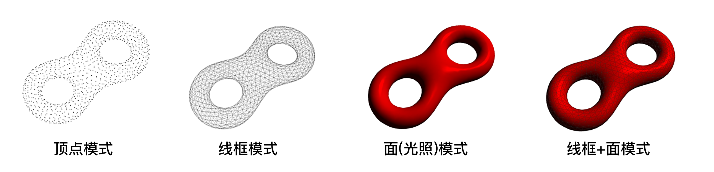
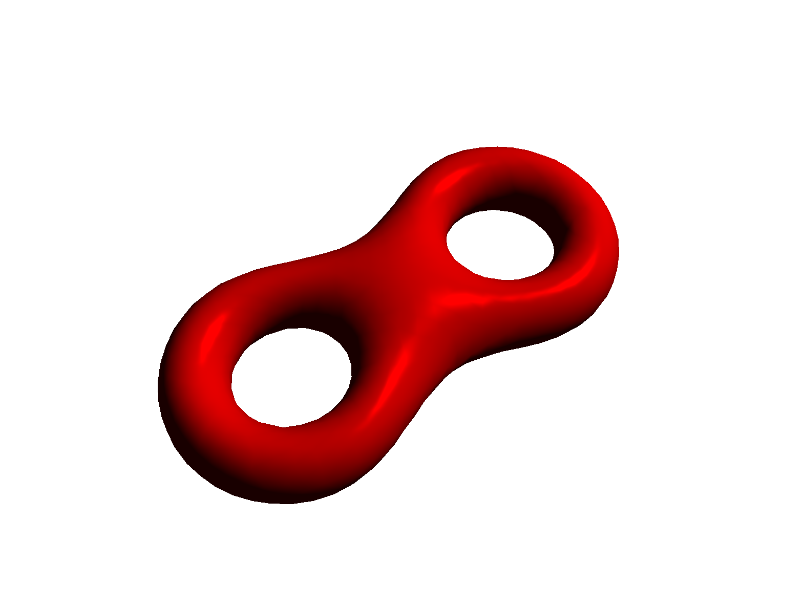

# B3+B4-HalfEdge模型显示、交互与光照

许书畅 2018213822 xsc14thu@foxmail.com

### 一、效果概览

#### 1.1 模型显示

HalfEdge数据结构读入模型后，进行显示：



#### 1.2 模型交互与光照

**交互：**鼠标左键点击并拖拽以旋转模型，鼠标中键滑动以缩放模型，效果详见视频。

**光照：**



### 二、实验环境

macOS15.1, OpenGL4

依赖库：GLFW3(窗口管理), GLAD(指针管理), GLM(矩阵运算)


### 三、交互方式

**模型操作**：鼠标左键点击并拖拽以旋转模型，鼠标中键滑动以缩放模型。

**场景漫游**：WASD键进行场景漫游。

**切换显示模式**：按下E(edge)，F(face)，V(vertex)键，以显示或隐藏边/面/顶点。


### 四、实验原理

#### 4.1 obj文件读取

由于obj模型较为简单，且本次实验的法向为程序计算，不需从外部读入。因此通过手写parser来读取obj。

#### **4.2 半边结构存储**

本项目使用半边结构存储Mesh，基本结构简略如下，注意所有的Vertex和Face均只存储一个HalfEdge的指针，而**不再存储任何邻接边/点/面的信息**，从而大大降低了存储空间。

```c++
class HalfEdge{
    HalfEdge *next, *prev, *oppo;
    Face *f;
    Vertex *v;
    //Other Application Data and Functions
  	//...
};

class Vertex{
    HalfEdge *e;
    //Other Application Data and Functions
  	//...
};


class Face{
    HalfEdge *e;
    //Other Application Data and Functions
  	//...
};

class MeshHDS{
    std::vector<Face*> _fs;
    std::vector<Vertex*> _vs;
    std::vector<HalfEdge*> _es;
    //Other Application Data and Functions
  	//...
};
```

注意，在读取obj数据保存到半边结构Mesh中前，会由如下的VerticesIndices结构体临时存储每个面上的顶点下标。但是该结构体仅仅在半边结构Mesh创建时用于索引，在创建完成后会被销毁。

```C++
struct VertexIndices{
    std::vector<int> indices_v;
};
```

#### 4.3 显示方式切换

使用glPolygonMode，切换模型的点/线/面渲染方式。参考：

www.khronos.org/registry/OpenGL-Refpages/gl4/html/glPolygonMode.xhtml

如果要同时显示线框和面，需要对一个模型进行多次渲染。


为了避免z-fighting现象的出现，使用PolygonOffset对模型点的z-buffer进行小幅度位移。

```C++
glEnable(GL_POLYGON_OFFSET_POINT);
glPolygonOffset(-2,-2);
```

#### 4.4 模型交互

利用鼠标按键与滑轮的callback机制，相应鼠标操作，改变模型的model矩阵，从而实现旋转与缩放。

#### 4.5 光照显示

##### （1）法向计算

对每个顶点，通过`对邻接面的法向按面积加权`来计算顶点法向。

由于使用半边结构存储网格，因此通过`pe = pe -> next -> oppo`来遍历邻接面。相关代码如下：

```c++
void Vertex::updateNormal(){
    glm::vec3 normal = glm::vec3(0.0f,0.0f,0.0f);
    
    HalfEdge* pe = this->e;
    
    do{
        normal += pe->f->getWeightedNormal();
        pe = pe->next->oppo;
    }while(pe != nullptr && pe != this->e);
    
    this->normal = glm::normalize(normal);
}
```

##### (2)光照模型

使用Phong模型进行光照渲染。