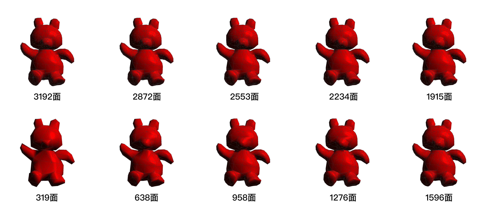

# B7-HalfEdge模型简化

许书畅 2018213822 xsc14thu@foxmail.com

### 一、效果概览



### 二、实验环境

macOS15.1, OpenGL4

依赖库：GLFW3(窗口管理), GLAD(指针管理), GLM(矩阵运算)


### 三、交互方式

按下M键持续进行网格简化，松开M键停止。

按下R键，复原原模型。


### 四、实验原理

#### 4.1 基本原理

参考Surface Simplification Using Quadric Error Metrics论文，按以下4步骤进行网格简化：

1. 为所有顶点计算$Q$矩阵

2. 对于任一边上的两个顶点，计算其最优合并点$\bar v$，进一步计算合并到该点的$\text{Quadric Error} = {\bar v}^{T}(Q_{1}+Q_{2}){\bar v}$ 
3. 以$\text{Quadric Error}$为依据，将所有的HalfEdge排列成一个最小堆。
4. 迭代获取最小堆的堆顶，将该HalfEdge进行合并，同时更新相关区域的网格结构与$\text{Quadric Error}$。

#### 4.2 顶点合并时需注意

具体执行第4步时，对于要合并的点对$(v_1,v_2)$，本项目将$v_{1}$移除，更新$v_{2}$的信息与连接关系。需要注意以下几步：

1. 对于所有与$v_{1}$有连接的顶点，确保其索引的HalfEdge不在即将被移除的面上。
2. 更新网格结构：将连接到$v_{1}$的HalfEdge，都连接到$v_{2}$
   - 将连接到$v_{1}$的HalfEdge，都连接到$v_{2}$
   - 移除$(v_1,v_2)$邻接的两个面，以及面上的所有HalfEdge
   - 移除$v_{1}$
3. 更新参数：对所有与$v_2$连接的点，更新其$Q$矩阵与法向量；对所有与$v_2$连接的HalfEdge，更新其合并的$\text{Quadric Error}$。

下附合并顶点部分的代码：

```C++
bool MeshHDS::contractPair(){
    if(_fs.size() < 0.1 * init_face_size) return false;
    std::pop_heap(_es.begin(),_es.end(),HalfEdge::minHeapCmp);
    HalfEdge* e2contract = _es.back();
    
    if(e2contract->getCost() > DBL_MAX / 2) {
        return false;
    }
    
    Vertex* v1 = e2contract -> prev -> v;
    Vertex* v2 = e2contract -> v;
    glm::vec4 vt = e2contract -> getVt();
    
    /* -------------------Step A: Preparation------------------- */
    //for vertices linked to v1, make sure its pointed e won't be erased
    HalfEdge* pe = e2contract->prev;
    do{
        pe = pe -> next;
        Vertex* tmpV = pe->v;
        HalfEdge* tmpE = tmpV->e;
        do{
            if(!e2contract->f->containsEdge(tmpE) &&
               !e2contract->oppo->f->containsEdge(tmpE)){
                tmpV->e = tmpE;
                break;
            }
            tmpE = tmpE -> next -> oppo;
        }while(tmpE != nullptr && tmpE != tmpV->e);
        pe = pe -> oppo;
    }while(pe != nullptr && pe != e2contract->prev);
    
    /* -------------------Step B: Rebuild Connections------------------- */
    //for half-edges linked to v1, relink them to v2
    pe = e2contract->prev;
    do{
        pe -> v = v2;
        pe = pe -> next -> oppo;
    }while(pe != nullptr && pe != e2contract->prev);
        
    //mind the order:
    //0. deal with e2contract_oppo before deleting e2contract
    //1. relink oppo
    //2. remove v1 - v2 faces
    //3. remove half_edges on v1 - v2 faces
    if(e2contract -> oppo != nullptr){
        HalfEdge* e2contract_oppo = e2contract -> oppo;
        e2contract_oppo->prev->oppo->oppo = e2contract_oppo->next->oppo;
        e2contract_oppo->next->oppo->oppo = e2contract_oppo->prev->oppo;
        _fs.erase(std::remove(_fs.begin(), _fs.end(), e2contract_oppo->f), _fs.end());
        _es.erase(std::remove(_es.begin(), _es.end(), e2contract_oppo->prev), _es.end());
        _es.erase(std::remove(_es.begin(), _es.end(), e2contract_oppo->next), _es.end());
        _es.erase(std::remove(_es.begin(), _es.end(), e2contract_oppo), _es.end());
        delete e2contract_oppo->f;
        delete e2contract_oppo->prev;
        delete e2contract_oppo->next;
        delete e2contract_oppo;
    }
    
    e2contract->prev->oppo->oppo = e2contract->next->oppo;
    e2contract->next->oppo->oppo = e2contract->prev->oppo;
    _fs.erase(std::remove(_fs.begin(), _fs.end(), e2contract->f), _fs.end());
    _es.erase(std::remove(_es.begin(), _es.end(), e2contract->prev), _es.end());
    _es.erase(std::remove(_es.begin(), _es.end(), e2contract->next), _es.end());
    _es.erase(std::remove(_es.begin(), _es.end(), e2contract), _es.end());
    delete e2contract->f;
    delete e2contract->prev;
    delete e2contract->next;
    delete e2contract;
    
    //remove v1
    _vs.erase(std::remove(_vs.begin(), _vs.end(), v1), _vs.end());
    delete v1;
    
    /* -------------------Step C: Update Parameters------------------- */
    /*update all simplification related parameters
      update normals
      make sure _es is still heap*/
    
    //update v2 position
    v2->position = glm::vec3(vt);
    
    //update Kp for v2-adjacent faces
    pe = v2->e;
    do{
        pe -> f -> updateKp();
        pe = pe -> next -> oppo;
    }while(pe != nullptr && pe != v2->e);
    
    //update (Q & Normal) for v2
    v2 -> updateQ();
    v2 -> updateNormal();
    
    //update (Q & Normal) for v2-adjacent vertices
    pe = v2->e;
    do{
        pe = pe -> next;
        pe -> v -> updateQ();
        pe -> v -> updateNormal();
        pe = pe -> oppo;
    }while(pe != nullptr && pe != v2->e);
    
    //update cost for v2-linked half-edges
    pe = v2->e;
    do{
        pe -> updateCost();
        pe = pe -> next;
        pe -> updateCost();
        pe = pe -> oppo;
    }while(pe != nullptr && pe != v2->e);
    
    //make sure _es is still heap
    std::make_heap(_es.begin(),_es.end(),HalfEdge::minHeapCmp);
    
    return true;
}
```

