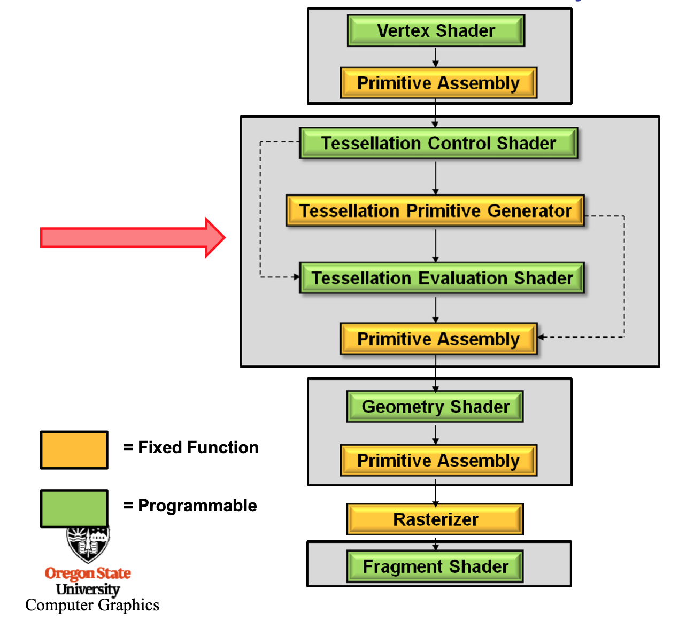

# B6-细分着色器绘制贝塞尔曲面

### 一、效果概览

其中加入了Phong模型光照效果，光源位置以橙色大正方形来显示。

### 二、实验环境

macOS15.1, OpenGL4

依赖库：GLFW3(窗口管理), GLAD(指针管理), GLM(矩阵运算)，SOIL(图像读取)

### 三、交互方式

按下C键切换线框/面显示。

按下Z键降低细分等级，按下X键提升细分等级。

按下R键，复原原模型。

按下O键向下移动光源，P键向上移动光源。

### 四、实验原理

#### 4.1 渲染管线

#### 4.2 基本原理

**TCS作用：**

1. 控制细分等级
2. 为TES提供需要的数据

**TPG作用：**

根据TCS中的细分等级，以及TES中的参数，对abstract patch进行细分，给出gl_TesselCoord坐标。

**TES作用：**

控制abstract patch的参数，包括primitive类型，细分间距，转向。

插值计算各个顶点的值，包括position，normal等。

注意！normal的计算，应该在world space中进行！！！

**[参考资料]**

曲面细分Shader原理：

http://www.cs.cornell.edu/courses/cs4621/2015fa/lectures/lec05-practicum-fa15.pdf

http://web.engr.oregonstate.edu/~mjb/cs519/Handouts/tessellation.1pp.pdf

曲面细分Shader文档：

https://www.khronos.org/opengl/wiki/Tessellation#Tessellation_primitive_generation

https://www.khronos.org/opengl/wiki/Tessellation_Control_Shader

https://www.khronos.org/opengl/wiki/Tessellation_Evaluation_Shader

其他参考：

https://zhuanlan.zhihu.com/p/42550699

https://www.cnblogs.com/zenny-chen/p/4280100.html

http://codeflow.org/entries/2010/nov/07/opengl-4-tessellation/
